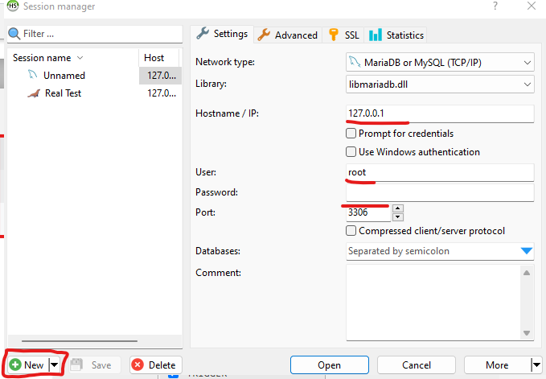

# External Connections into Databases

There is a really nice software called HeidiSQL that allows you to conntect externally into databases, you can get it [here](https://www.heidisql.com/download.php).\

If you already have configured accounts/databases you can login using your user accounts credentials

<figure><figcaption></figcaption></figure>

The `Hostname/IP:` is your public IPv4 Address of the machine where the database is hosted.\
You can find this IP Via command prompt and run the command `ipconfig`.\
\
Using this external connection, if using an account with the correct privileges or just using the root user, you can do all the same functions you can do inside of PHPMyAdmin.\
\
Now you can access your databases from anywhere with an internet connection!
