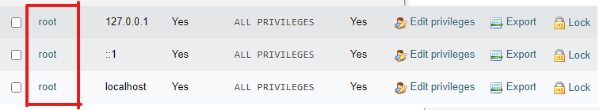
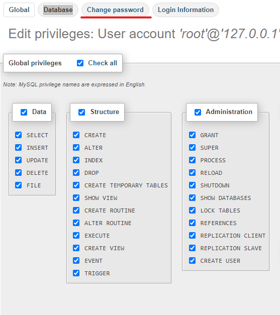

# Changing the Root Password

You will want to change your root password (local user that is given all privilidges)\
This account is your most important account so you will want to change the password within the MySQL application as well as within XAMPP so it can log into it with the correct credentials.\
\
You will now want to click on `User Accounts` on the homepage of your PHPmyadmin\


<figure><figcaption></figcaption></figure>

After that, you will want to click on all of your root accounts and change the passwords to what ever you want them to be.

<figure><figcaption></figcaption></figure>

<figure><figcaption></figcaption></figure>

Once you change these, you will not be able to log back into your PHPmyadmin until you change the credentials inside of XAMPP. \
To do this, you will need to reopen your XAMPP interface and go to the following.\
\
Press Explorer then go to this file path `C:\xampp\phpMyAdmin\config.inc.php` _(assuming you downloaded this onto your main drive)_\


You will then want to open that file with your preferred text editor and go to the line

```php
$cfg['Servers'][$i]['password'] = ' ';
```

Inside of that quotes **AFTER** `['password'] =` you will enter the password you set for your root accounts.\
\
Now your Databases are protected on your local network or anyone trying to access the root account from an external endpoint.\
